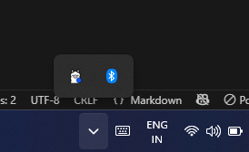
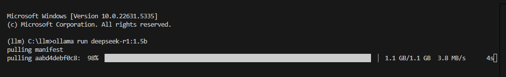
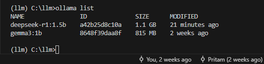
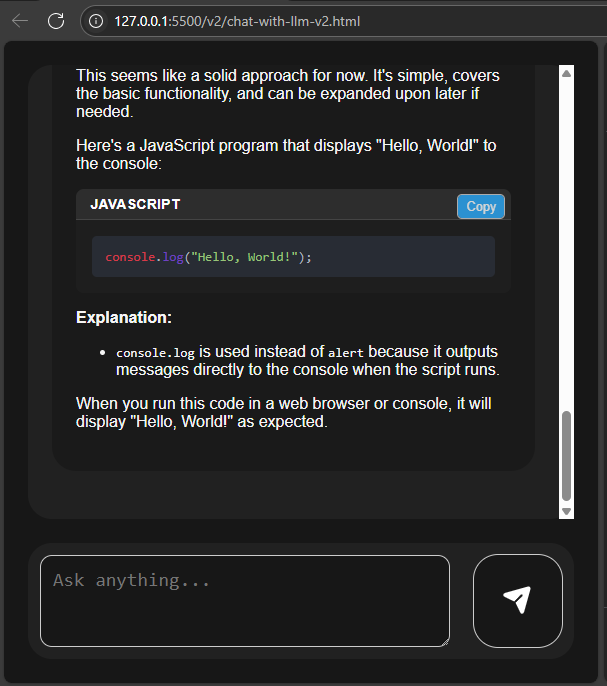

# Ollama Chat API Script

This project demonstrates how to use the local [Ollama](https://ollama.com) API to interact with an AI model via Python. It includes instructions to install the necessary tools, download a model, and run a sample chat script.

## Prerequisites

- Python 3.7+
- pip (Python package installer)
- Internet connection (to download the model)
- [Ollama](https://ollama.com) installed and running locally

## Step 1: Install Ollama

Download and install Ollama from the official site:

👉 [https://ollama.com/download](https://ollama.com/download)

Once installed, make sure Ollama is running,
or run by  clicking the app icon on your machine.


## Step 2: Download a LLM model

Run following command to one a LLM model


```bash
ollama run gemma3:1b  # This command downloads the gemma3:1b model if it’s not already present.

```
or 

```bash
ollama run deepseek-r1:1.5b  

```


Run following command to check if the LLM model downloaded successfully
```bash

ollama list 

```



## Step 2: Install Packages
Install packages mentioned in project's requirements.txt file

```
  pip install -r requirements.txt
```
## Step 3: Run and Enjoy
```
python v1/chat-with-llm.py
```
or 
```
python v2/server-of-llm-v2.py

```

## Demo v2

